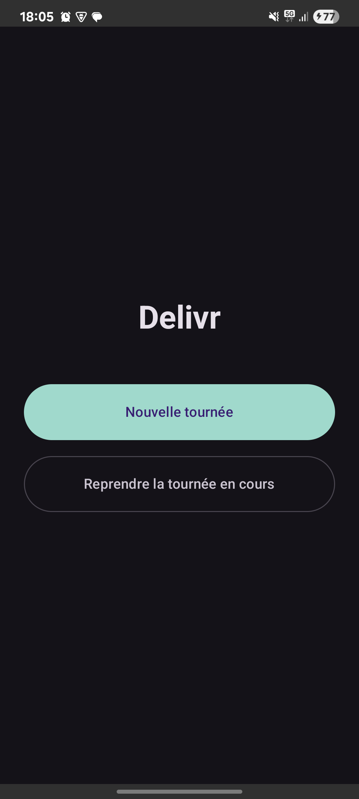
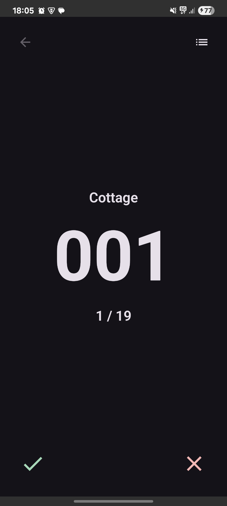

# Delivr

  
  
  
  

Delivr est une application Android native qui automatise la préparation des tournées de livraison
de petits déjeuners dans un centre de loisirs. Elle scanne la feuille de livraison A4 du jour, en
extrait les numéros de cottages présents dans la colonne « Cott » par reconnaissance de texte, les
trie dans l'ordre logique de la tournée, puis guide l'utilisateur cottage par cottage jusqu'à la
fin.

L'application fonctionne entièrement hors ligne : aucun serveur, aucun cloud, aucun compte n'est
nécessaire.

## Aperçu

  
  

## Fonctionnalités

* Scan d'une feuille de livraison A4, avec détection du document, correction de perspective et
  amélioration du contraste
* Extraction automatique des numéros de cottages par reconnaissance de texte hors ligne
* Suppression des doublons et tri automatique, dans l'ordre croissant ou décroissant au choix
* Écran de validation permettant d'ajouter, modifier ou supprimer un cottage avant de démarrer
* Mode Livraison minimaliste : numéro du cottage courant en très grand, position dans la tournée,
  actions Livré, Annulé et Retour
* Écran Liste : vue d'ensemble de tous les cottages avec leur statut, et navigation rapide vers
  n'importe lequel d'entre eux
* Sauvegarde automatique et continue de la tournée en cours : fermer l'application ne fait perdre
  aucune donnée, la reprise se fait exactement là où elle a été laissée

## Stack technique

* Kotlin et Jetpack Compose
* Architecture MVVM
* Google ML Kit Document Scanner pour la capture, la détection des bords, le redressement de
  perspective et l'amélioration du contraste étant gérés directement par le SDK, sans caméra
  personnalisée
* Google ML Kit Text Recognition pour l'OCR, entièrement hors ligne
* Room, via KSP, pour la sauvegarde locale de la tournée en cours

## Ouvrir le projet

1. Ouvrir le dossier dans Android Studio (Ladybug ou plus récent).
2. Laisser Gradle synchroniser (le wrapper est déjà configuré : Gradle 8.13, AGP 8.13.2, Kotlin
   2.2.21).
3. Lancer l'application sur un appareil ou un émulateur Android 8.0 (API 26) ou supérieur.

## Structure du projet

Le code de l'application vit dans `app/src/main/java/com/delivr/app/` :

* `DelivrApplication.kt`, seul conteneur d'injection du projet, sans framework tiers
* `ui/`, les écrans Compose (accueil, scan, validation, livraison, liste) et leurs ViewModels
* `navigation/`, le graphe de navigation entre les écrans
* `domain/`, la logique métier pure (tri, extraction, statuts), sans dépendance Android
* `camera/`, l'intégration du scanner ML Kit
* `ocr/`, l'intégration de la reconnaissance de texte ML Kit
* `repository/`, le pont entre la logique métier et la base de données locale
* `database/`, la persistance Room (base de données, entités, accès aux données)
* `utils/`, les utilitaires partagés (chargement d'image, etc.)

## Workflow Git

Une seule branche (`main`), des commits atomiques, une fonctionnalité par commit.

Les messages de commit suivent la convention
[Conventional Commits](https://www.conventionalcommits.org/) : c'est ce que lit le workflow de
release pour calculer automatiquement le prochain numéro de version.

* `feat: ...` déclenche une nouvelle version mineure (`0.1.0` devient `0.2.0`)
* `fix: ...` déclenche une nouvelle version de correctif (`0.1.0` devient `0.1.1`)
* un pied de commit `BREAKING CHANGE: ...` déclenche une nouvelle version majeure (`0.1.0` devient
  `1.0.0`). Le seul `!` accolé au type dans l'intitulé (`feat!: ...`) ne suffit pas : le calcul de
  version de ce workflow s'appuie sur le préréglage Angular, qui exige le pied de commit explicite
  pour reconnaître un changement majeur
* `docs:`, `chore:`, `refactor:`, `test:`, et les autres types couvrent le reste

## Intégration et livraison continues

Deux workflows GitHub Actions accompagnent le projet :

* **CI** : à chaque push ou pull request sur `main`, exécute les tests unitaires, la vérification
  de style (ktlint) et le lint Android, puis construit une APK de debug téléchargeable en artifact.
* **Release** : à chaque push sur `main` qui passe les tests, calcule le prochain tag SemVer à
  partir des Conventional Commits, construit une APK release signée, publie une GitHub Release
  avec l'APK attachée et le changelog généré automatiquement, puis met à jour `CHANGELOG.md`.

Pour tester une nouvelle version sur un téléphone : ouvrir la dernière
[GitHub Release](https://github.com/Samuellct/Delivr/releases), télécharger l'APK depuis le
téléphone, puis l'installer. Elle remplace directement la version précédente sans perte de
données, grâce à un `applicationId` et une clé de signature stables.

## Signature de la release

Le keystore de release et ses identifiants ne sont jamais commités dans le dépôt : ce sont des
secrets, résolus dans cet ordre par la configuration Gradle du projet :

1. Variables d'environnement dédiées, utilisées par le workflow de release, qui reconstitue le
   fichier de signature à partir d'un secret GitHub encodé, jamais commité ni journalisé.
2. Un fichier de configuration local, pour signer une release directement depuis un poste de
   développement.
3. En l'absence des deux : le build release reste simplement non signé (le build debug fonctionne
   toujours normalement).
